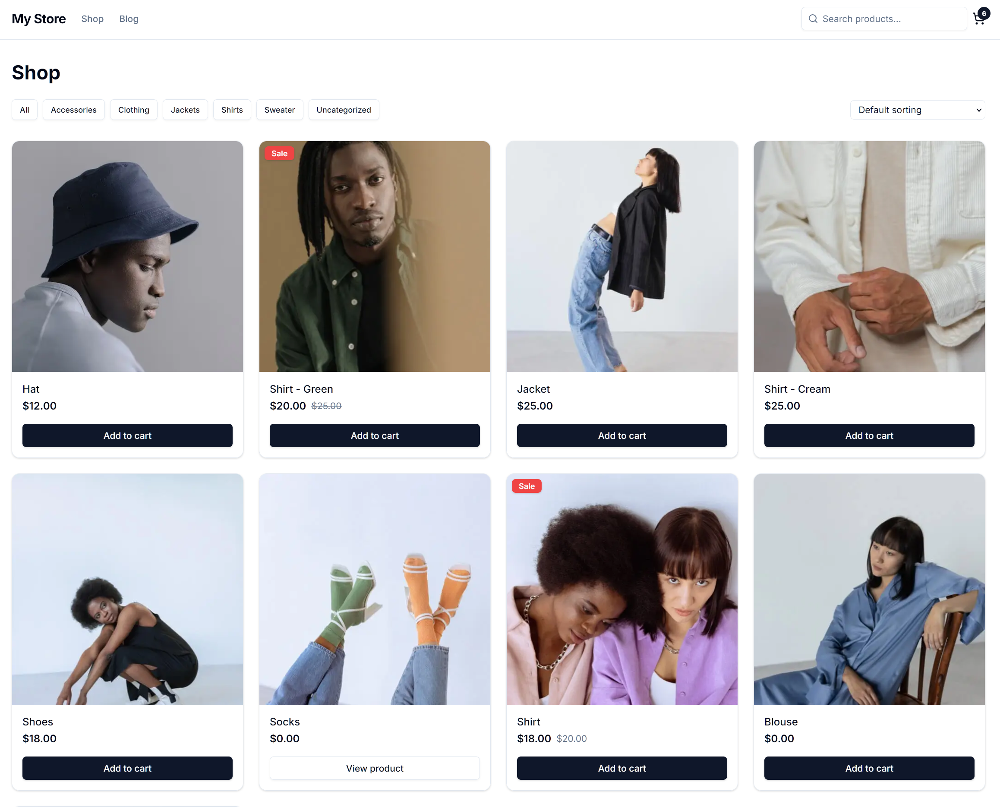

# CoCart Starter — Next.js

A headless WooCommerce storefront built with Next.js App Router, React 19, TypeScript, Tailwind CSS, and shadcn/ui — powered by [CoCart](https://cocartapi.com).

> **This project was scaffolded by [create-cocart](https://github.com/cocart-headless/create-cocart).**
> Your store URL and WordPress URL have already been substituted into the relevant files.

> [!IMPORTANT]
> This starter template is still a work in progress. It is currently being tested along with [create-cocart](https://github.com/cocart-headless/create-cocart) CLI tool to identify issues or improve before publicly announcing it ready for use.

## Screenshot



## Features

- **Product browsing** — listing, category filtering, sorting, and product detail pages
- **Product types** — separate templates for simple and variable products; variable products show attribute selectors
- **Product search** — `/search?q=...` with server-side CoCart API query
- **Cart** — React context with debounced quantity updates; all cart requests proxied through Next.js API routes to avoid CORS
- **Blog** — WordPress posts and post detail pages via the REST API
- **Checkout shell** — ready for a payment gateway (see below)
- **Responsive** — mobile menu with inline search, desktop nav with search input
- **SEO** — Open Graph metadata on product and post pages, `/sitemap.xml`, `/robots.txt`
- **Error boundaries** — per-section error pages with retry, global 404

---

## Quick start

```bash
# Clone the repository
git clone https://github.com/cocart-headless/cocart-template-nextjs.git
cd cocart-template-nextjs

# Set up environment variables
cp .env.example .env.local

# Start development server
npm install
npm run dev
```

Your store runs at `http://localhost:3000`.

---

## Environment variables

Copy `.env.example` to `.env.local` and fill in:

```bash
# CoCart / WooCommerce store
NEXT_PUBLIC_COCART_STORE_URL=https://your-store.com
NEXT_PUBLIC_COCART_STORE_HOSTNAME=your-store.com   # used in next.config.ts for image domains

# WordPress site (for blog — may be the same as your store)
NEXT_PUBLIC_WORDPRESS_URL=https://your-store.com
NEXT_PUBLIC_WORDPRESS_HOSTNAME=your-store.com      # used in next.config.ts for image domains
```

> `STORE_HOSTNAME` and `WORDPRESS_HOSTNAME` should be just the hostname (no `https://`). Add both to the `remotePatterns` in `next.config.ts` to enable Next.js image optimisation for product and blog images.

---

## Adding a payment gateway

The checkout page (`app/checkout/page.tsx`) is a minimal shell. To wire up a payment gateway run:

```bash
create-cocart init --extensions checkout
```

This installs `@cocartheadless/checkout`, prompts you to pick a gateway (Stripe, PayPal, or Authorize.Net), and injects the `CheckoutForm` component into the checkout page.

---

## Project structure

```text
app/
  layout.tsx            Root layout — CartProvider, Open Graph defaults
  page.tsx              Homepage — hero, featured products, categories
  error.tsx             Global error boundary
  not-found.tsx         404 page
  sitemap.ts            /sitemap.xml
  robots.ts             /robots.txt
  api/
    cart/
      route.ts          GET cart proxy (avoids CORS)
      add-item/         POST add item
      update-item/      POST update quantity
      remove-item/      DELETE remove item
      clear/            DELETE clear cart
  shop/
    page.tsx            Product listing with category filter + sort
    loading.tsx         Skeleton loading state
    error.tsx           Error boundary
    [slug]/page.tsx     Product detail — routes to simple or variable template
    category/[slug]/    Category listing with active filter indicator
  cart/page.tsx         Cart (client component)
  checkout/
    page.tsx            Checkout shell (add gateway with CLI)
    thank-you/page.tsx  Order confirmation
  posts/
    page.tsx            Blog listing
    loading.tsx         Skeleton loading state
    error.tsx           Error boundary
    [slug]/page.tsx     Post detail with OG metadata
  search/
    page.tsx            Search results (/search?q=...)
    loading.tsx         Skeleton loading state

lib/
  cocart-server.ts      Server-only CoCart client (RSC / API routes)
  cocart.ts             Browser cart helpers — all calls proxied via /api/cart
  cocart.d.ts           Product, Category, Cart, CartItem types
  wordpress.ts          WordPress REST API helpers
  wordpress.d.ts        Post, Author, FeaturedMedia types
  utils.ts              cn(), formatPrice()

components/
  ui/                   shadcn/ui — Button, Card, Badge, Input, Skeleton
  layout/               Header, Footer, Nav, MobileMenu
  shop/
    product-card.tsx    Grid card — Add to cart / Select options / View product
    product-simple.tsx  Simple product page template
    product-variable.tsx Variable product template with attribute selectors
    product-meta.tsx    SKU, categories, stock status, related products
    product-gallery.tsx Image gallery
    add-to-cart-button.tsx Optional quantity stepper + add button
    sort-select.tsx     URL-based sort dropdown
    search-input.tsx    Search input
  cart/                 CartProvider, CartItem (debounced qty), CartSummary, CartCount
  posts/                PostCard
```

---

## Scripts

```bash
npm run dev       # development server
npm run build     # production build
npm run start     # production server
npm run lint      # ESLint
npm run typecheck # TypeScript (no emit)
```

---

## Tech stack

| | |
|---|---|
| [Next.js](https://nextjs.org/) | React framework (App Router) |
| [React 19](https://react.dev/) | UI library |
| [TypeScript](https://www.typescriptlang.org/) | Type safety |
| [Tailwind CSS](https://tailwindcss.com/) | Styling |
| [shadcn/ui](https://ui.shadcn.com/) | UI components |
| [craft](https://github.com/brijr/craft) | Flexible design system |
| [@cocartheadless/sdk](https://www.npmjs.com/package/@cocartheadless/sdk) | CoCart API client |

---

## Troubleshooting

**Products not loading**
Verify CoCart is installed and check the API at `your-store.com/wp-json/cocart/v2/products`.

**Images not loading**
Set `NEXT_PUBLIC_COCART_STORE_HOSTNAME` and `NEXT_PUBLIC_WORDPRESS_HOSTNAME` and update `remotePatterns` in `next.config.ts`.

**Blog posts not loading**
Verify the WordPress REST API is accessible at `your-wordpress-url/wp-json/wp/v2/posts`. REST API requires pretty permalinks — go to Settings → Permalinks and select any option except "Plain".

---

## License

MIT
